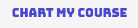
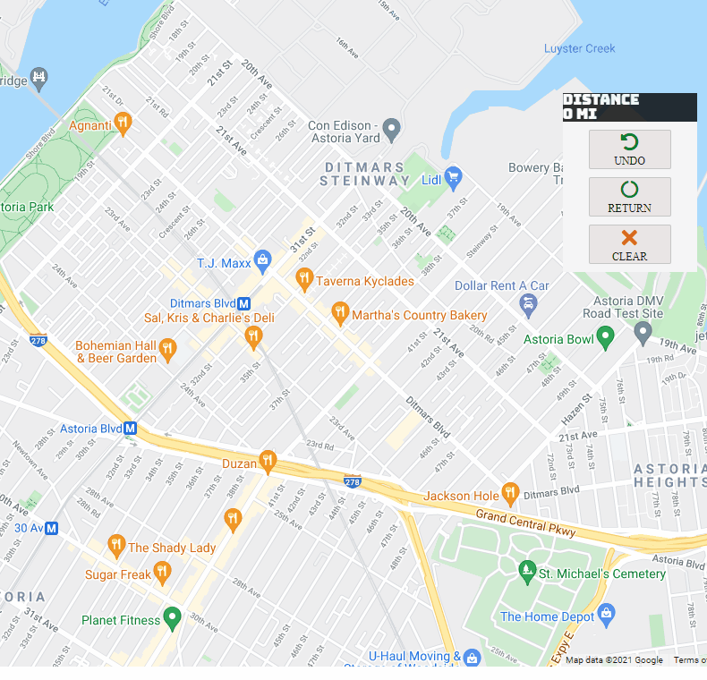
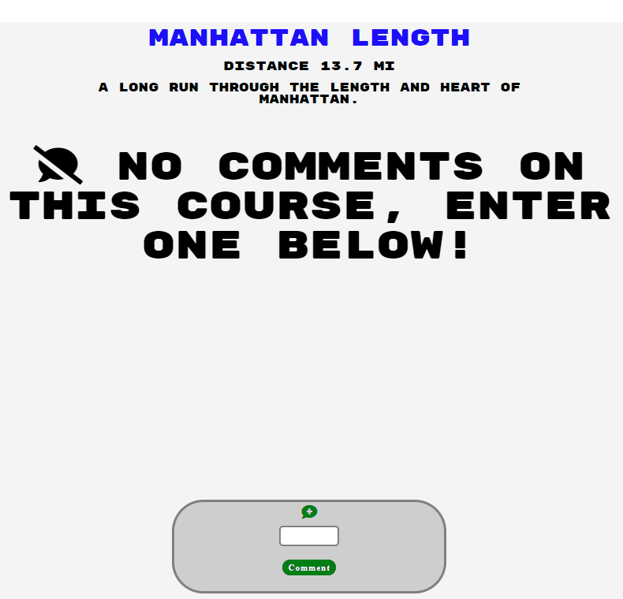

# [<p align="center"></p>][1]


ChartMyCourse is a single-page web application and clone of [MapMyRun][2]; it enables users to create running routes, add other users as friends and comment on other users courses using:  

* Google Maps JavaScript API
* Directions API
* Postgresql database
* Ruby on Rails
* React/Redux
* Javascript
* CSS

## <p align="center">[Link to Live Site](https://chart-my-course.herokuapp.com/#/)<p/>

# Course Creator
MapMyRun allows users to create routes using Google Maps API and then decide what kind of workout they woud like to do using a side toolbar. I decided to simplify the interface as I found MapMyRuns too clunky and unintuitive. I did away with choosing workouts and decided to focus specifically on running/walking routes. I made Input to be two simple fields, a course name and a description, and also simplified the map toolbar with only three buttons: Undo Waypoint, Clear Waypoint, Return to Start. This is all done by implementing Google Maps API and Direction API, React/Redux state and props, and CSS in order to create a smooth, intuitive and clear course creating experience. Clicking on the map adds a waypoint and connects previously added waypoints to each other in real time, updating both the map, and the distance display toolbar.      

<p align="center"></p>

## Google Maps/Directions API code Snippets

```js
    //  Create Map using Google Maps API with either Central Park or a previously saved routes first point as its center. Adds event listener (click) to enable creation of waypoints on map by extracting longitude + latitude from the point clicked.
    createMap(){
        const newYork = new google.maps.LatLng(40.785091, -73.968285);
        const center = this.state.waypoints.length > 0 ? this.state.waypoints[0] : newYork;
        const mapOptions = {center, zoom: 14}
        this.map = new google.maps.Map(this.mapNode, mapOptions);
        this.map.addListener('click', this.createWaypoint);
    }

    createWaypoint(e){
        this.currentWaypoints.push({lat: e.latLng.lat(), lng: e.latLng.lng()});
        this.renderRoutes();
    }


    // Course creation + distance updating using Directions API functions
    renderRoutes(){
        if (!this.directionsService) {this.directionsService = new google.maps.DirectionsService();}
        if(!this.directionsDisplay) {this.directionsDisplay = new google.maps.DirectionsRenderer({map: this.map, preserveViewport: true});}
        const midWaypoints = this.currentWaypoints.slice(1, this.currentWaypoints.length - 1);
        const wpts = midWaypoints.map(way => ({
            location: way,
            stopover: false
        }));

        const initialWaypoint = {
            origin: this.currentWaypoints[0],
            destination: this.currentWaypoints[this.currentWaypoints.length - 1],
            travelMode: 'WALKING',
            waypoints: wpts
        }

        this.directionsService.route(initialWaypoint, (result, status) => {
            if (status === 'OK') {
                this.directionsDisplay.setDirections(result);
                this.updateDistance(result);
            }
        });
        this.setState({waypoints: this.currentWaypoints.slice()});
    }

    // Side Toolbar Buttons for returning to the start of the course, undoing the last waypoint creating and clearing all points. Also the distance updating function.
    
    clearMarkers(){
        if (this.currentWaypoints.length > 0){
            this.currentWaypoints = [];
            this.directionsDisplay.setDirections({routes: this.currentWaypoints});
            this.setState({ distance: '0 MI', waypoints: [] });
        }
    }

    returnToOrigin(){
        if (this.state.waypoints.length > 1){
            this.currentWaypoints.push(this.currentWaypoints[0]);
            this.renderRoutes();
        }
    }

    undoWaypoint(){
        if (this.currentWaypoints.length < 2){
            this.clearMarkers();
        } else {
            this.currentWaypoints.pop();
            this.renderRoutes();
        }
    }


```

# Comment Creation/Display
Comments are dynamically rendered using React/Redux changes of state and lifecycle methods. Conditionals are used in render functions to determine if a comment belongs to the current user and if so, a delete button is rendered for those comments belonging to the user.

<p align="center"></p>

## Comment Creation Code Snippet

```js
// Rendering conditionally based on whether there are comments and whether the comments belongs to the user currently signed in
 <div className='comments-container'>
                     {Object.values(comments).length < 1 ? 
                        <div className='no-comments-message'>
                         <div className='fas fa-comment-slash'></div> No comments on this course, enter one below!</div>
                     : Object.values(comments).map((comment, idx) => (
                            <div className='comment-container' key={idx}>
                               <span className='comment-username'>{comment.username} says:</span>
                                 <p className='comment-body'>{comment.body}</p>
                                  <div className='comment-delete-container'>
                                    {comment.author_id === currentUser.id ?
                                     <button onClick={() => this.removeComment(comment.id)} className='remove-comment-button'> DELETE</button>
                                     : null}
                                    </div>
                                </div>
                            ))}
</div>

// Checking whether the comment props have updated using React lifecycle method
    componentDidUpdate(prevProps){
        if (Object.values(this.props.comments).length !== Object.values(prevProps.comments).length){
            this.props.requestCourseComments(this.props.match.params.courseId);
            this.props.requestCourse(this.props.match.params.courseId);
        }
    }


```

# ChartMyCourse was Created by Alejandro Weil

### [LinkedIn][3]
### [AngelList][5]
### [Personal Site][6]
### [Github][4]


[1]: https://chart-my-course.herokuapp.com/#/
[2]: https://www.mapmyrun.com/
[3]: https://www.linkedin.com/in/alejandro-weil-b9275720b/
[4]: https://aweil13.github.io/PortfolioSite/
[5]: https://angel.co/u/alejandro-weil
[6]: https://aweil13.github.io/PortfolioSite/